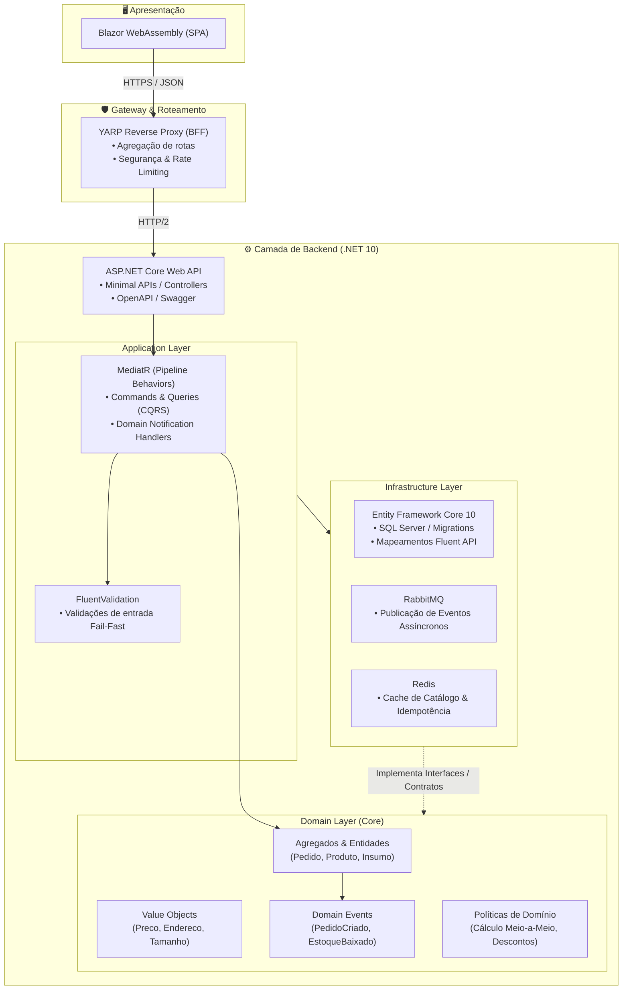

# 🍕 Sistema de Gestão de Restaurante & Delivery

<p align="center">
  
  
  
  
  
  
</p>

---

Sistema corporativo completo para gestão e operação de restaurantes e serviços de delivery — abrangendo venda personalizada de pizzas, sanduíches, combos dinâmicos, acompanhamentos e bebidas, com controle rigoroso de fluxo de pedidos, estoque e precificação.

O projeto foi concebido seguindo os mais elevados padrões de engenharia de software contemporânea, combinando **Domain-Driven Design (DDD)**, **Clean Architecture**, **CQRS com MediatR**, **BFF Pattern com YARP** e **Event-Driven Architecture**.

---

## 📑 Sumário

- [Visão Geral & Domínio](#-visão-geral--domínio)
- [Destaques das Regras de Negócio](#-destaques-das-regras-de-negócio)
- [Arquitetura & Engenharia](#-arquitetura--engenharia)
- [Tecnologias Utilizadas](#-tecnologias-utilizadas)
- [Estrutura da Solução](#-estrutura-da-solução)
- [Documentação de Discovery](#-documentação-de-discovery)
- [Como Executar o Projeto](#-como-executar-o-projeto)
- [Roadmap de Desenvolvimento](#-roadmap-de-desenvolvimento)
- [Autor & Licença](#-autor--licença)

---

## 🎯 Visão Geral & Domínio

O sistema atende toda a jornada operacional do restaurante, desde o cardápio interativo até a entrega final e avaliação:

- **Catálogo Inteligente:** Suporte a diferentes categorias de itens (Pizzas, Sanduíches, Bebidas e Sucos) com regras específicas de personalização.
- **Pizzas Customizáveis:** Mecanismo de meio-a-meio (até 2 sabores), multiplicadores dinâmicos por tamanho (Broto, Média, Grande, Família) e regras de precificação automática (cobrança pelo maior valor).
- **Adicionais & Opcionais:** Gestão de bordas recheadas e ingredientes extras vinculados a itens específicos com trava anti-abuso.
- **Combos Promocionais:** Agrupamento de itens principais com bebidas aplicando descontos percentuais automáticos.
- **Ciclo de Vida do Pedido (State Machine):** Gestão de estados estritos (`Rascunho` ➔ `AguardandoPagamento` ➔ `Pago` ➔ `EmPreparo` ➔ `Pronto` ➔ `EmRota` ➔ `Entregue`), impedindo transições e cancelamentos inválidos.
- **Logística & Entrega:** Cálculo de taxa de entrega por localidade, regras de pedido mínimo e isenção de frete para valores promocionais.
- **Controle de Estoque Reativo:** Baixa de insumos sincronizada ao início da produção com alertas de reposição.

---

## 📋 Destaques das Regras de Negócio

| Código | Regra | Resumo da Diretriz |
| :--- | :--- | :--- |
| **RN-001** | **Pizza Meio-a-Meio** | Permitida a partir do tamanho Médio; o preço base final é determinado pelo sabor de maior valor; adicionais divididos proporcionalmente. |
| **RN-002** | **Adicionais** | Vinculáveis exclusivamente a Pizzas e Sanduíches; limite máximo de 5 adicionais por item sem repetição do mesmo insumo. |
| **RN-003** | **Combos Promocionais** | Composto no mínimo por 1 item principal + 1 bebida; desconto fixado em 15%; itens de combo não aceitam adicionais. |
| **RN-004** | **Tamanhos e Fatias** | Broto (4 fatias, não aceita meio-a-meio), Média (6 fatias), Grande (8 fatias) e Família (12 fatias). |
| **RN-005** | **Taxa de Entrega** | Baseada em zoneamento de bairros; pedido mínimo de R$ 30,00; frete grátis em pedidos a partir de R$ 100,00. |
| **RN-006** | **Cancelamentos** | O cancelamento só é autorizado estritamente antes do status `PreparoIniciado`. |
| **RN-007** | **Baixa de Estoque** | Ocorre no momento do início do preparo do pedido; sinaliza `EstoqueBaixo` quando o saldo for inferior a 5 unidades. |
| **RN-008** | **Precisão Financeira** | Todos os valores monetários utilizam tipo `decimal(10,2)` com arredondamento `MidpointRounding.AwayFromZero`. |

---

## 🏗️ Arquitetura & Engenharia

A solução adota **Clean Architecture** e **DDD**, garantindo isolamento absoluto entre regras de negócio corporativas e detalhes de infraestrutura (banco de dados, mensageria e frameworks de terceiros).

### Diagrama de Comunicação & Fluxo



### Princípios Arquiteturais Aplicados
- **Domain-Driven Design (DDD):** Modelagem rica em entidades, value objects, agregados bem delimitados e eventos de domínio.
- **CQRS (Command Query Responsibility Segregation):** Separação de fluxos de leitura (Read Models otimizados) e escrita (Commands com validação de invariantes).
- **Backend-for-Frontend (BFF):** Utilização do YARP para prover camada intermediária segura, isolando a API principal de acessos diretos de navegadores.
- **Fail-Fast Validations:** Pipeline behaviors no MediatR que abortam requisições inválidas antes que atinjam o domínio.

---

## 🛠️ Tecnologias Utilizadas

### Core & Framework
- **[.NET 10 SDK](https://dotnet.microsoft.com/)** (`10.0.100`) com **C# 13/14**
- **[ASP.NET Core Web API](https://learn.microsoft.com/aspnet/core/)** com suporte a OpenAPI 2.0 / Swagger
- **[Blazor WebAssembly](https://dotnet.microsoft.com/apps/aspnet/web-apps/blazor)** como Single Page Application (SPA) reativa
- **[YARP (Yet Another Reverse Proxy)](https://microsoft.github.io/reverse-proxy/)** como BFF e proxy reverso

### Aplicação & Domínio
- **[MediatR 14.x](https://github.com/jbogard/MediatR):** Mensageria em memória, mediação de casos de uso e pipeline behaviors
- **[FluentValidation 12.x](https://fluentvalidation.net/):** Validação declarativa fortemente tipada de commands e viewmodels

### Persistência & Infraestrutura
- **[Entity Framework Core 10.x](https://learn.microsoft.com/ef/core/):** ORM com suporte a SQL Server e migrações automáticas
- **[Redis](https://redis.io/):** Estratégia de cache distribuído e controle de concorrência
- **[RabbitMQ](https://www.rabbitmq.com/):** Message broker para propagação de eventos entre bounded contexts

### Testes & Qualidade
- **[xUnit 2.9.x](https://xunit.net/):** Framework de testes de unidade e integração
- **[Coverlet Collector](https://github.com/coverlet-coverage/coverlet):** Análise e métricas de cobertura de código
- **Microsoft.NET.Test.Sdk**: Suporte ao test runner do .NET CLI

---

## 📂 Estrutura da Solução

```text
Restaurante/
├── docs/
│   └── discovery/
│       ├── business-rules/         # Regras de negócio detalhadas (RN-001 a RN-008) e precificação
│       ├── event-storming/         # Artefatos do Event Storming (Big Picture e Process Level)
│       └── glossary/               # Glossário da Linguagem Ubíqua e mapeamento de conceitos
├── src/
│   ├── Restaurante.Domain/         # Entidades, Agregados, Value Objects, Regras e Eventos de Domínio
│   ├── Restaurante.Application/    # Casos de Uso (CQRS), Handlers MediatR, DTOs e Validadores
│   ├── Restaurante.Infrastructure/ # EF Core DbContext, Repositórios, Mapeamentos, Migrations e Broker
│   ├── Restaurante.Api/            # ASP.NET Core Web API, Controllers/Endpoints e Middlewares
│   ├── Restaurante.Bff/            # YARP Reverse Proxy, roteamento de requisições e segurança
│   └── Restaurante.Client/         # Frontend SPA moderno em Blazor WebAssembly (.NET 10)
├── tests/
│   ├── Restaurante.Domain.Tests/      # Testes Unitários de invariantes de domínio e regras de cálculo
│   └── Restaurante.Application.Tests/ # Testes de Handlers de comandos, consultas e pipelines
├── Restaurante.slnx                # Arquivo unificado da solução (.NET 10 Solution Format)
├── global.json                     # Fixação de versão do SDK .NET
└── README.md                       # Apresentação e guia do projeto
```

---

## 📚 Documentação de Discovery

Toda a fase de concepção e modelagem estratégica do sistema está documentada em arquivos dedicados:

- 📖 **[Glossário Ubíquo](docs/discovery/glossary/glossary.md):** Definição precisa dos termos de negócio utilizados pela equipe e no código-fonte.
- 📐 **[Regras de Negócio](docs/discovery/business-rules/rules.md):** Especificação detalhada de cada regra (RN-001 a RN-008) com matriz de rastreabilidade.
- 💲 **[Tabela de Preços & Multiplicadores](docs/discovery/business-rules/pricing.md):** Tabelas base de valores de produtos, adicionais e fatores de escala por tamanho.
- ⚡ **[Event Storming — Big Picture](docs/discovery/event-storming/big-picture.md):** Visão cronológica dos fluxos operacionais, eventos e atores do restaurante.
- 🔬 **[Event Storming — Process Level](docs/discovery/event-storming/process-level.md):** Comandos, agregados, eventos, read models e pontos críticos (hotspots) dos Bounded Contexts.

---

## 🚀 Como Executar o Projeto

### Pré-requisitos

- [.NET 10 SDK](https://dotnet.microsoft.com/) instalado em sua máquina.
- [Docker](https://www.docker.com/) (recomendado para instanciar SQL Server, Redis e RabbitMQ com agilidade) ou instâncias locais desses serviços.
- IDE recomendada: Visual Studio 2026, VS Code ou JetBrains Rider.

### 1. Clonar o Repositório

```bash
git clone https://github.com/tavilo/Restaurante.git
cd Restaurante
```

### 2. Restaurar Dependências & Compilar

```bash
# Restaura todos os pacotes NuGet da solução
dotnet restore

# Compila a solução completa
dotnet build
```

### 3. Executar a Suíte de Testes

```bash
dotnet test --logger "console;verbosity=detailed"
```

### 4. Executar os Componentes

Em terminais separados:

```bash
# 1. Iniciar a API Principal
dotnet run --project src/Restaurante.Api

# 2. Iniciar o BFF (YARP Proxy)
dotnet run --project src/Restaurante.Bff

# 3. Iniciar o Client (Blazor WebAssembly)
dotnet run --project src/Restaurante.Client
```

---

## 🚦 Roadmap de Desenvolvimento

- [x] **Fase 0 — Discovery & Planejamento Estratégico**
  - [x] Definição de Personas, User Stories e Matriz de Rastreabilidade
  - [x] Glossário da Linguagem Ubíqua
  - [x] Event Storming (Big Picture & Process Level)
  - [x] Mapeamento dos Bounded Contexts e Hotspots
- [ ] **Fase 1 — Modelagem do Domínio (Restaurante.Domain)**
  - [ ] Entidades de Catálogo (`Produto`, `Categoria`, `Adicional`)
  - [ ] Agregado Raiz `Pedido` com máquina de estados
  - [ ] Value Objects (`Preco`, `Endereco`, `TamanhoPizza`)
  - [ ] Políticas de Precificação (Meio-a-Meio e Combos)
  - [ ] Cobertura de Testes Unitários de Domínio (xUnit)
- [ ] **Fase 2 — Camada de Aplicação (Restaurante.Application)**
  - [ ] Implementação de Commands, Queries e Handlers (MediatR)
  - [ ] Validações fluentes e Behaviors de pipeline (FluentValidation)
  - [ ] Handlers de Eventos de Domínio
- [ ] **Fase 3 — Infraestrutura & Persistência (Restaurante.Infrastructure)**
  - [ ] Mapeamento EF Core com Fluent API e Migrations
  - [ ] Repositórios e Unit of Work
  - [ ] Integração com RabbitMQ (Publicação/Assinatura de Eventos)
  - [ ] Cache distribuído com Redis
- [ ] **Fase 4 — Exposição de Serviços (Restaurante.Api & BFF)**
  - [ ] Endpoints RESTful documentados com OpenAPI
  - [ ] Configuração do YARP Reverse Proxy no BFF
  - [ ] Tratamento global de exceções e padronização RFC 7807 (ProblemDetails)
- [ ] **Fase 5 — Interface com o Usuário (Restaurante.Client)**
  - [ ] Cardápio digital interativo em Blazor WebAssembly
  - [ ] Fluxo de montagem de pizza e carrinho de compras
  - [ ] Acompanhamento de status de pedido em tempo real
- [ ] **Fase 6 — Qualidade, E2E & Observabilidade**
  - [ ] Testes de ponta a ponta
  - [ ] Configuração de métricas, tracing e logs estruturados (OpenTelemetry)
  - [ ] Pipeline de CI/CD

---

## 👨‍💻 Autor

**Tavilo Breno**  
📧 Email: [breno_wk2@hotmail.com](mailto:breno_wk2@hotmail.com)  

---

## 📄 Licença

Este projeto está licenciado sob a licença **MIT** — consulte o arquivo [LICENSE.txt](LICENSE.txt) para mais detalhes.
